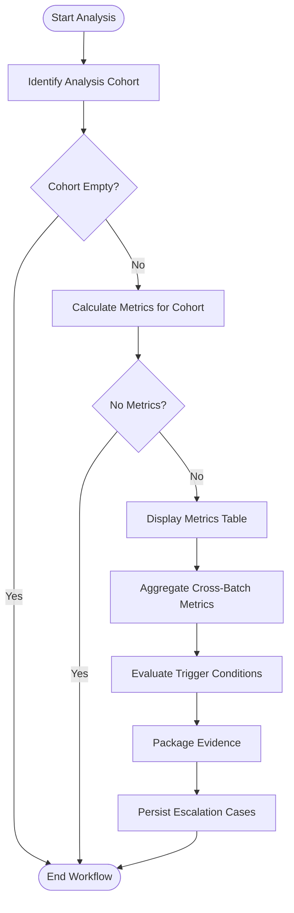

# Appendix C. Escalation Logic and Thresholds
The Escalation Analyzer monitors the Shared Memory Bus for two types of failure triggers. The specific thresholds ($\theta$) were calibrated on a hold-out set of 5 batches, which are **NOT** used in the main evaluation/analysis.

## C.1. Batch-Local Triggers (Transient Failures)
These triggers fire immediately after a batch completes Tier 1 processing.
* **Performance Drop**: Triggers if Batch Macro F1 < 0.8.
* **Maladaptive Update**: Triggers if the F1 score decreases after the Review/Revise loop (i.e., $F1_{revised} < F1_{initial}$).

## C.2. Cross-Batch Triggers (Systemic Failures)
These triggers evaluate a rolling window of the last $N=20$ **evaluation** batches.
* **Persistent Gap**: Triggers if the mean F1 for any specific aspect (e.g., 'ambience') is < 0.80 across the window.
* **High Variance**: Triggers if the standard deviation of F1 scores for a aspect is > 0.20, indicating unstable behavior.

## C.3 Escalation Process 
Below diagram shows the simplified escalation process.

